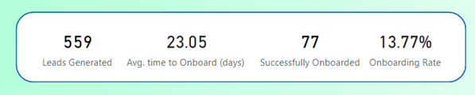
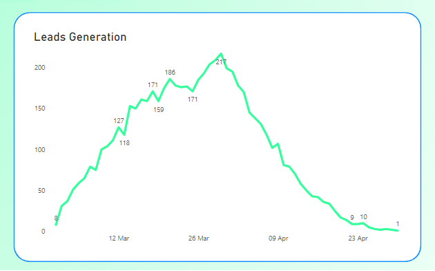
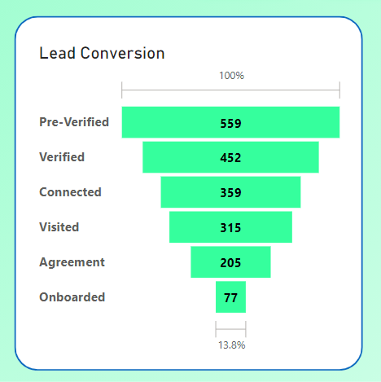
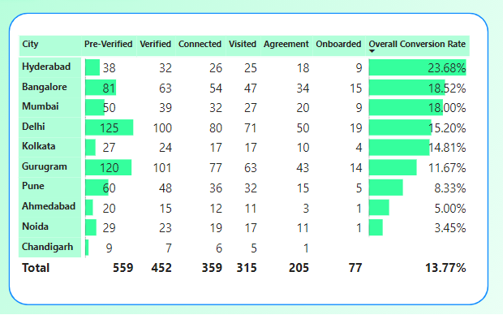
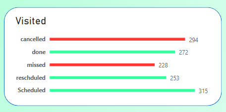
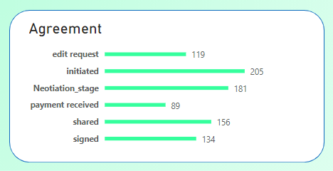

# Sales Funnel Analysis for Hostel Chain

The Sales Funnel Analysis for the Strent AH Pvt Limited (SAPL) hostel chain provides critical insights into the lead generation process, conversion rates, and key areas for improvement. The analysis spans from lead generation to onboarding, identifying challenges and opportunities for process optimization.

## • Key Metrics

  1. Total Leads Generated: 559
  2. Successfully Onboarded: 77
  3. Overall Conversion Rate (Onboarding Rate): 13.77%
  4. Average Time to Onboard: 23.05 days

 ## •	Lead Generation Insights 
 
Lead generation shows promising growth initially, with a  noticeable drop after March 31, 2023. Further investigation required to understand the cause of the drop, potentially seasonal trends or operational issues.

## •	Sales Funnel Overview

1. Leads Generated i.e Pre-Verified: 559
2. Verified: 452 (Conversion Rate ~ 80 %) 
3. Connected: 359 (Conversion Rate ~ 80 %)
4. Visited: 315 (Conversion Rate ~ 87 %)
5. Agreement: 205 (Conversion Rate ~ 65 %)
6. Onboarded: 77 (Conversion Rate ~ 35 %)

 

## • City-wise Leads Insights

Varied conversion rates highlight opportunities and challenges in different cities. Some cities show high demand but lower conversion rates, while others with lower lead generation have higher conversion rates. Cities like Hyderabad, Mumbai and Bangalore exhibit lower lead generation but comparatively higher conversion rates. Whereas Delhi & Gurugram have significantly high demand but conversion rate is relatively low.     

## • Most Lead Lost in Funnel Stages

Most leads are lost in the Visited and Agreement stages. Between Visited to Agreement Conversion  ~ 65% leads lost and In Agreement to Onboarded Conversion ~ 37% leads lost.

 
 

## • Average Time to Onboard 
  Students spend an average of ~ 23 days from Pre-Verified to Onboarding stage. Average time spend in funnel is quite high by industry standards. Needs process improvements to reduce overall time spent in the funnel. 

## Recommendation

1. Process Improvement Survey: Conduct a comprehensive survey to identify bottlenecks in all stages of funnel. And Specifically inefficiencies in the Visited and Agreement stages.
2. Regional Demand Analysis: Analyze regional variations in demand and tailor marketing strategies accordingly.
3. Marketing Strategy: Develop a targeted marketing strategy based on potential seasonality and regional demand.
4. Customer Journey Optimization: Streamline the customer journey to reduce the average time spent in the funnel

## Conclusion 

  The Sales Funnel Analysis reveals opportunities for improvement in lead conversion rates and operational efficiency. Addressing issues in the Visited and Agreement stages, understanding regional demand, and optimizing marketing strategies can contribute to a more effective sales funnel. Reducing the average time spent in the funnel will enhance overall customer satisfaction. The recommendations aim to provide actionable insights for ongoing improvements and strategic planning.

#### Click here : [Live PowerBi Report](https://www.novypro.com/project/sales-funnel-analysis-for-hostel-chain-power-bi-1)

